<p align="center"></p>

# pipelines

Automated fabric pipelines: gateway tools composed into scheduled, ambient homelab intelligence. Each pipeline is a small TypeScript program that calls tools through the [git-fabric gateway](https://github.com/git-fabric/gateway), correlates what it finds, and reports. They run as Kubernetes CronJobs.

| Pipeline | Schedule | First tools it calls |
|---|---|---|
| [Security Triage](1-security-triage/) | every 6 hours | `sandfly_get_alerts`, `cve_enrich`, `cve_triage`, `chat_session_create` |
| [GitOps Observer](2-gitops-observer/) | every 15 minutes | `k8s_pod_problems`, `k8s_list_argocd_apps`, `k8s_list_events` |
| [Network Audit](3-network-audit/) | daily at 02:00 | `ts_list_devices`, `unifi_list_devices`, `sandfly_list_hosts`, `cf_list_dns_records` |
| [Proxmox ↔ K8s Correlation](4-proxmox-k8s/) | every 30 minutes | `pve_list_nodes`, `pve_list_vms`, `k8s_list_nodes`, `k8s_list_longhorn_volumes` |
| [Daily Ops Briefing](5-ops-chat/) | daily at 08:00 | `chat_search`, `chat_session_create`, `chat_context_inject`, `chat_message_send` |

## Layout

```
N-name/pipeline.ts     # the pipeline
N-name/cronjob.yaml    # its Kubernetes CronJob
shared/                # gateway client, dispatch, chat, metrics
Dockerfile             # one image for all pipelines
```

## Build

```bash
npm install
docker build -t fabric-pipelines .
```

<!-- org-footer -->
---

<p align="center"><sub>Part of <a href="https://github.com/git-fabric">git-fabric</a> · composable fabric apps for Git-native infrastructure · built by <a href="https://github.com/ry-ops">ry-ops</a></sub></p>
